# Migration Guide: From Iconify `logos` Pack to AWS Mermaid Icons

This guide helps you migrate from using Iconify's `logos` pack to the custom AWS icon pack for Mermaid diagrams.

## Why Migrate?

### Benefits of Using the AWS Icon Pack

- **855+ icons** vs 65 in logos pack - Complete AWS service coverage
- **Consistent styling** - All icons from official AWS Architecture Icons
- **Resource icons** - Includes resources like S3 buckets, EventBridge topics, etc.
- **Category icons** - Architecture group and category icons
- **Direct hosting** - Load from GitHub, no npm dependency needed
- **Always up-to-date** - Easy to update with latest AWS icons

### When to Keep Using `logos` Pack

- You need icons for non-AWS services (other cloud providers, tools, etc.)
- You prefer npm package distribution
- You want to use both packs simultaneously

---

## Quick Comparison

### Current Setup (logos pack)

```javascript
import mermaid from 'mermaid';

mermaid.registerIconPacks([
  {
    name: 'logos',
    loader: () =>
      fetch('https://unpkg.com/@iconify-json/logos@1/icons.json')
        .then((res) => res.json()),
  },
]);
```

**Usage in diagrams:**
```
service lambda(logos:aws-lambda)[Lambda]
service s3(logos:aws-s3)[S3]
```

### New Setup (aws pack)

```javascript
import mermaid from 'mermaid';

mermaid.registerIconPacks([
  {
    name: 'aws',
    loader: () =>
      fetch('https://raw.githubusercontent.com/harmalh/aws-mermaid-icons/main/iconify-json/aws-icons.json')
        .then((res) => res.json()),
  },
]);
```

**Usage in diagrams:**
```
service lambda(aws:aws-lambda)[Lambda]
service s3(aws:amazon-simple-storage-service)[S3]
```

---

## Icon Name Mapping

### Complete Icon Mapping Table

Based on analysis of both icon packs, here's the complete mapping:

#### Exact Matches (23 icons)
These icons have the same name - just change `logos:` to `aws:`:

| logos Pack | aws Pack |
|------------|----------|
| `logos:aws-amplify` | `aws:aws-amplify` |
| `logos:aws-app-mesh` | `aws:aws-app-mesh` |
| `logos:aws-appsync` | `aws:aws-appsync` |
| `logos:aws-backup` | `aws:aws-backup` |
| `logos:aws-batch` | `aws:aws-batch` |
| `logos:aws-certificate-manager` | `aws:aws-certificate-manager` |
| `logos:aws-cloudformation` | `aws:aws-cloudformation` |
| `logos:aws-cloudtrail` | `aws:aws-cloudtrail` |
| `logos:aws-codebuild` | `aws:aws-codebuild` |
| `logos:aws-codecommit` | `aws:aws-codecommit` |
| `logos:aws-codedeploy` | `aws:aws-codedeploy` |
| `logos:aws-codepipeline` | `aws:aws-codepipeline` |
| `logos:aws-config` | `aws:aws-config` |
| `logos:aws-elastic-beanstalk` | `aws:aws-elastic-beanstalk` |
| `logos:aws-fargate` | `aws:aws-fargate` |
| `logos:aws-glue` | `aws:aws-glue` |
| `logos:aws-lake-formation` | `aws:aws-lake-formation` |
| `logos:aws-lambda` | `aws:aws-lambda` |
| `logos:aws-secrets-manager` | `aws:aws-secrets-manager` |
| `logos:aws-shield` | `aws:aws-shield` |
| `logos:aws-step-functions` | `aws:aws-step-functions` |
| `logos:aws-systems-manager` | `aws:aws-systems-manager` |
| `logos:aws-waf` | `aws:aws-waf` |

#### Amazon Variants (22 icons)
These use `amazon-` prefix instead of `aws-`:

| logos Pack | aws Pack |
|------------|----------|
| `logos:aws-api-gateway` | `aws:amazon-api-gateway` |
| `logos:aws-appflow` | `aws:amazon-appflow` |
| `logos:aws-athena` | `aws:amazon-athena` |
| `logos:aws-aurora` | `aws:amazon-aurora` |
| `logos:aws-cloudfront` | `aws:amazon-cloudfront` |
| `logos:aws-cloudsearch` | `aws:amazon-cloudsearch` |
| `logos:aws-cloudwatch` | `aws:amazon-cloudwatch` |
| `logos:aws-cognito` | `aws:amazon-cognito` |
| `logos:aws-documentdb` | `aws:amazon-documentdb` |
| `logos:aws-dynamodb` | `aws:amazon-dynamodb` |
| `logos:aws-ec2` | `aws:amazon-ec2` |
| `logos:aws-elasticache` | `aws:amazon-elasticache` |
| `logos:aws-eventbridge` | `aws:amazon-eventbridge` |
| `logos:aws-keyspaces` | `aws:amazon-keyspaces` |
| `logos:aws-kinesis` | `aws:amazon-kinesis` |
| `logos:aws-lightsail` | `aws:amazon-lightsail` |
| `logos:aws-mq` | `aws:amazon-mq` |
| `logos:aws-neptune` | `aws:amazon-neptune` |
| `logos:aws-quicksight` | `aws:amazon-quicksight` |
| `logos:aws-rds` | `aws:amazon-rds` |
| `logos:aws-redshift` | `aws:amazon-redshift` |
| `logos:aws-timestream` | `aws:amazon-timestream` |

#### Special Cases

| logos Pack | aws Pack | Notes |
|------------|----------|-------|
| `logos:aws-s3` | `aws:amazon-simple-storage-service` | Full service name |
| `logos:aws-ecs` | `aws:amazon-elastic-container-service` | Full service name |
| `logos:aws-glacier` | `aws:amazon-simple-storage-service-glacier` | Part of S3 |
| `logos:aws-xray` | `aws:aws-x-ray` | Uses hyphen |

#### Not Available in AWS Pack (19 icons)
These icons from the logos pack are not available in the AWS pack. You may need to:
- Keep using the `logos` pack for these specific icons
- Use alternative icons from the AWS pack
- Check if similar icons exist with different names

| logos Pack | Status |
|------------|--------|
| `logos:aws-codestar` | Not available |
| `logos:aws-ecs` | Use `amazon-elastic-container-service` instead |
| `logos:aws-eks` | Not available (use `amazon-eks-cloud` or `amazon-eks-anywhere` if needed) |
| `logos:aws-elastic-cache` | Use `amazon-elasticache` instead |
| `logos:aws-elb` | Not available |
| `logos:aws-iam` | Not available (use `aws-identity-access-management-iam-access-analyzer` or similar) |
| `logos:aws-kms` | Not available (use `aws-key-management-service` if available) |
| `logos:aws-mobilehub` | Not available |
| `logos:aws-msk` | Not available |
| `logos:aws-open-search` | Not available |
| `logos:aws-opsworks` | Not available |
| `logos:aws-route53` | Not available |
| `logos:aws-ses` | Not available |
| `logos:aws-sns` | Not available |
| `logos:aws-sqs` | Not available |
| `logos:aws-vpc` | Not available (use VPC resource icons like `amazon-vpc-lattice`) |

**Note**: The AWS pack focuses on architecture icons. Some services may have resource icons but not main service icons. Check the full icon list in `iconify-json/aws-icons.json` for alternatives.

---

## Step-by-Step Migration

### Step 1: Register the AWS Icon Pack

Add the AWS icon pack registration to your code. You can register both packs simultaneously during migration:

```javascript
import mermaid from 'mermaid';

// Register both packs (during migration)
mermaid.registerIconPacks([
  {
    name: 'logos',  // Keep existing pack
    loader: () =>
      fetch('https://unpkg.com/@iconify-json/logos@1/icons.json')
        .then((res) => res.json()),
  },
  {
    name: 'aws',  // Add new pack
    loader: () =>
      fetch('https://raw.githubusercontent.com/harmalh/aws-mermaid-icons/main/iconify-json/aws-icons.json')
        .then((res) => res.json()),
  },
]);

mermaid.initialize({ startOnLoad: true });
```

### Step 2: Update Icon References in Diagrams

Update your Mermaid diagrams to use the new `aws:` prefix and correct icon names.

#### Example 1: Simple Service

**Before:**
```
service lambda(logos:aws-lambda)[Lambda]
```

**After:**
```
service lambda(aws:aws-lambda)[Lambda]
```

#### Example 2: Service with Different Name

**Before:**
```
service s3(logos:aws-s3)[S3]
service api(logos:aws-api-gateway)[API Gateway]
```

**After:**
```
service s3(aws:amazon-simple-storage-service)[S3]
service api(aws:amazon-api-gateway)[API Gateway]
```

#### Example 3: Complete Diagram

**Before:**


**After:**


```mermaid
architecture-beta
group aws_cloud(aws:aws)[AWS Cloud]
service api_gw(aws:amazon-api-gateway)[API GW]
service lambda(aws:aws-lambda)[Lambda]
service s3(aws:amazon-simple-storage-service)[S3]
service dynamodb(aws:amazon-dynamodb)[DynamoDB]
```

### Step 3: Test Your Diagrams

1. **Load your diagrams** and verify icons render correctly
2. **Check browser console** for any icon loading errors
3. **Verify icon appearance** matches expectations

### Step 4: Remove Old logos Pack (Optional)

Once all diagrams are migrated and tested, you can remove the `logos` pack registration:

```javascript
import mermaid from 'mermaid';

// Only AWS pack (after migration)
mermaid.registerIconPacks([
  {
    name: 'aws',
    loader: () =>
      fetch('https://raw.githubusercontent.com/harmalh/aws-mermaid-icons/main/iconify-json/aws-icons.json')
        .then((res) => res.json()),
  },
]);

mermaid.initialize({ startOnLoad: true });
```

---

## Complete Migration Example

### Your Current Diagram (using logos pack)



### Migrated Diagram (using aws pack)

```mermaid
architecture-beta
%% Panel MVP – compact grid (AWS icons, dash edges)

group aws_cloud(aws:aws)[AWS Cloud]

group ingestion(aws:aws)[Ingestion] in aws_cloud

service api_gw(aws:amazon-api-gateway)[API GW] in ingestion

service presign(aws:aws-lambda)[Presign] in ingestion

service s3_raw(aws:amazon-simple-storage-service)[S3 Raw] in ingestion

group processing(aws:aws)[Processing] in aws_cloud

service etl(aws:aws-lambda)[ETL] in processing

service s3_cur(aws:amazon-simple-storage-service)[S3 Curated] in processing

service crawler(aws:aws-glue)[Glue Crawler] in processing

group analytics(aws:aws)[Analytics] in aws_cloud

service athena(aws:amazon-athena)[Athena] in analytics

service ath_res(aws:amazon-simple-storage-service)[S3 Results] in analytics

group clients(internet)[Clients]

service bi_tool(aws:aws)[BI Tool] in clients

service r_python(aws:aws)[R and Python] in clients

%% Top row (L→R)

api_gw:R -- L:presign

presign:R -- L:s3_raw

s3_raw:R -- L:etl

etl:R -- L:s3_cur

s3_cur:R -- L:crawler

crawler:R -- L:athena

athena:R -- L:ath_res

%% Bottom row (Clients under Analytics)

bi_tool:T -- B:athena

r_python:T -- B:athena
```


### Changes Made:
- `logos:aws` → `aws:aws` (for groups)
- `logos:aws-api-gateway` → `aws:amazon-api-gateway`
- `logos:aws-lambda` → `aws:aws-lambda` ✅ (exact match)
- `logos:aws-s3` → `aws:amazon-simple-storage-service`
- `logos:aws-glue` → `aws:aws-glue` ✅ (exact match)
- `logos:aws-athena` → `aws:amazon-athena`

---

## Finding Icon Names

### Method 1: Check the Icon Pack JSON

Browse the icon pack directly:
```
https://raw.githubusercontent.com/harmalh/aws-mermaid-icons/main/iconify-json/aws-icons.json
```

Search for the service name you need (e.g., search for "s3" or "lambda").

### Method 2: Use Browser Console

```javascript
// After registering the pack
const icons = await fetch('https://raw.githubusercontent.com/harmalh/aws-mermaid-icons/main/iconify-json/aws-icons.json')
  .then(res => res.json());

// Search for icons containing "s3"
Object.keys(icons.icons).filter(name => name.includes('s3'));
// Returns: ['amazon-simple-storage-service', 'amazon-s3-on-outposts', ...]
```

### Method 3: Check Documentation

See the [USAGE.md](USAGE.md) guide for common icon names and patterns.

---

## Using Both Packs Simultaneously

You can use both packs at the same time if you need non-AWS icons from the `logos` pack:

```javascript
mermaid.registerIconPacks([
  {
    name: 'logos',
    loader: () =>
      fetch('https://unpkg.com/@iconify-json/logos@1/icons.json')
        .then((res) => res.json()),
  },
  {
    name: 'aws',
    loader: () =>
      fetch('https://raw.githubusercontent.com/harmalh/aws-mermaid-icons/main/iconify-json/aws-icons.json')
        .then((res) => res.json()),
  },
]);
```

**Usage:**
```
service lambda(aws:aws-lambda)[Lambda]          # AWS pack
service github(logos:github)[GitHub]             # logos pack
service docker(logos:docker)[Docker]             # logos pack
```

---

## Troubleshooting

### Icon Not Found

**Problem**: Icon doesn't render after migration

**Solutions**:
1. **Check icon name** - Verify the exact name in `aws-icons.json`
2. **Check syntax** - Ensure you're using `(aws:icon-name)` not `icon:aws:icon-name`
3. **Check pack registration** - Verify `registerIconPacks` was called before diagram rendering
4. **Check browser console** - Look for fetch errors or icon loading failures

### Icon Name Doesn't Match

**Problem**: `logos:aws-s3` doesn't work as `aws:aws-s3`

**Solution**: Check the mapping table above. S3 uses `amazon-simple-storage-service`:
```
logos:aws-s3 → aws:amazon-simple-storage-service
```

### Icons Not Loading

**Problem**: Icons fail to load from GitHub

**Solutions**:
1. **Check URL** - Verify the GitHub raw URL is correct
2. **Check CORS** - GitHub raw URLs support CORS by default
3. **Check network** - Verify internet connection and GitHub availability
4. **Use fallback** - Consider hosting the JSON file on your own server/CDN

### Mixed Pack Usage

**Problem**: Want to use some icons from `logos` and some from `aws`

**Solution**: Register both packs and use appropriate prefixes:
```
service aws_lambda(aws:aws-lambda)[Lambda]      # AWS pack
service github(logos:github)[GitHub]            # logos pack
```

---

## Migration Checklist

- [ ] Register the `aws` icon pack
- [ ] Update all `logos:aws-*` references to `aws:*`
- [ ] Update icon names that differ (see mapping table)
- [ ] Test all diagrams render correctly
- [ ] Verify icons appear as expected
- [ ] Update documentation/comments
- [ ] (Optional) Remove `logos` pack registration

---

## Need Help?

- **Icon names**: Check `iconify-json/aws-icons.json` or [USAGE.md](USAGE.md)
- **Syntax issues**: See [Mermaid Architecture Documentation](https://mermaid.js.org/syntax/architecture.html#icons)
- **Registration**: See [Mermaid Icon Registration Guide](https://mermaid.js.org/config/icons.html)
- **Issues**: Open an issue on [GitHub](https://github.com/harmalh/aws-mermaid-icons)

---

## Quick Reference

### Registration
```javascript
mermaid.registerIconPacks([
  {
    name: 'aws',
    loader: () =>
      fetch('https://raw.githubusercontent.com/harmalh/aws-mermaid-icons/main/iconify-json/aws-icons.json')
        .then((res) => res.json()),
  },
]);
```

### Syntax
```
service name(aws:icon-name)[Label]
group name(aws:aws)[Label]
```

### Common Icons
- Lambda: `(aws:aws-lambda)`
- S3: `(aws:amazon-simple-storage-service)`
- API Gateway: `(aws:amazon-api-gateway)`
- DynamoDB: `(aws:amazon-dynamodb)`
- RDS: `(aws:amazon-rds)`
- CloudFront: `(aws:amazon-cloudfront)`

