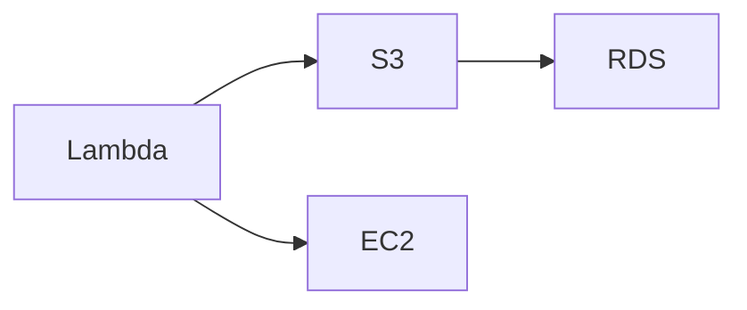

# AWS Icons for Mermaid

Complete AWS icon pack for use with Mermaid.js architecture diagrams. Contains **855 AWS icons** including services, resources, and categories from AWS Architecture Icons.

## Quick Start

### Load Icons in Mermaid

```javascript
import mermaid from 'mermaid';

mermaid.registerIconPacks([
  {
    name: 'aws',
    loader: () =>
      fetch('https://raw.githubusercontent.com/harmalh/aws-mermaid-icons/main/iconify-json/aws-icons.json')
        .then((res) => res.json()),
  },
]);

mermaid.initialize({ startOnLoad: true });
```

### Use in Diagrams



**With AWS Icons** (architecture-beta syntax):
```text
architecture-beta
  group aws-services "AWS Services" {
    service lambda icon:aws:aws-lambda
    service s3 icon:aws:aws-s3
    service ec2 icon:aws:aws-ec2
    service rds icon:aws:amazon-rds
  }
```

> **Note**: The `architecture-beta` diagram type requires Mermaid v11+ and may not render in GitHub's markdown preview. Use the HTML examples below for full functionality.

## Icon Naming

Icons use the prefix `aws:` and follow these naming conventions:

- **AWS Services**: `aws:aws-{service-name}` (e.g., `aws:aws-lambda`, `aws:aws-s3`)
- **Amazon Services**: `aws:amazon-{service-name}` (e.g., `aws:amazon-rds`, `aws:amazon-ec2`)
- **Resource Icons**: `aws:{resource-name}` (e.g., `aws:amazon-eventbridge-topic`)

## Contents

- **855 icons** including:
  - **~300-400 AWS service icons** (Arch_*)
  - **~200-300 resource icons** (Res_*) - e.g., S3 buckets, EventBridge topics
  - **~50-100 category/group icons** - Architecture categories and groups
- **Iconify JSON format** - Compatible with Mermaid and Iconify
- **SVG sources** - Original SVG files included
- **All AWS services** - Including ones already in Iconify

## Files

- `iconify-json/aws-icons.json` - Complete icon pack in Iconify format
- `svg/` - Source SVG files (for reference/editing)

## Building

To rebuild the icon pack from source:

```bash
npm run custom:build
```

This will:
1. Scan all SVG files in `Icons/` folder
2. Convert them to Iconify format
3. Generate `iconify-json/aws-icons.json`
4. Copy SVG sources to `svg/`

## Usage Examples

### HTML Example

```html
<!DOCTYPE html>
<html>
<head>
  <script type="module">
    import mermaid from 'https://cdn.jsdelivr.net/npm/mermaid@11/dist/mermaid.esm.min.mjs';
    
    mermaid.registerIconPacks([
      {
        name: 'aws',
        loader: () =>
          fetch('https://raw.githubusercontent.com/harmalh/aws-mermaid-icons/main/iconify-json/aws-icons.json')
            .then((res) => res.json()),
      },
    ]);
    
    mermaid.initialize({ startOnLoad: true });
  </script>
</head>
<body>
  <div class="mermaid">
    architecture-beta
      service lambda icon:aws:aws-lambda
      service s3 icon:aws:aws-s3
  </div>
</body>
</html>
```

### React Example

```jsx
import { useEffect } from 'react';
import mermaid from 'mermaid';

function MermaidDiagram() {
  useEffect(() => {
    mermaid.registerIconPacks([
      {
        name: 'aws',
        loader: () =>
          fetch('https://raw.githubusercontent.com/harmalh/aws-mermaid-icons/main/iconify-json/aws-icons.json')
            .then((res) => res.json()),
      },
    ]);
    
    mermaid.initialize({ startOnLoad: true });
    mermaid.contentLoaded();
  }, []);

  return <div className="mermaid">{diagramCode}</div>;
}
```

## Icon List

The pack includes icons for:

- **Compute**: EC2, Lambda, ECS, EKS, Fargate, App Runner, etc.
- **Storage**: S3, EBS, EFS, FSx, Glacier, etc.
- **Database**: RDS, DynamoDB, DocumentDB, Neptune, etc.
- **Networking**: VPC, CloudFront, Route 53, API Gateway, etc.
- **Security**: IAM, KMS, Secrets Manager, Shield, WAF, etc.
- **Analytics**: Athena, Redshift, EMR, Kinesis, QuickSight, etc.
- **AI/ML**: SageMaker, Bedrock, Rekognition, Comprehend, etc.
- **And 800+ more services and resources**

## Source

Icons are sourced from [AWS Architecture Icons](https://aws.amazon.com/architecture/icons/) and provided under the AWS Customer Agreement.

## License

This icon pack is provided under the same license as AWS Architecture Icons (AWS Customer Agreement). See AWS Architecture Icons terms for usage guidelines.

## Contributing

To add or update icons:

1. Add SVG files to `Icons/` folder
2. Run `npm run custom:build`
3. Commit changes
4. Submit pull request

## GitHub Repository Setup

This pack is designed to be hosted on GitHub for easy CDN access:

1. Create a new repository: `aws-mermaid-icons`
2. Copy `custom-pack/` contents to repository root
3. Update README with your GitHub username
4. Use raw GitHub URLs for loading icons

## Support

For issues or questions:
- Open an issue on GitHub
- Check [Mermaid documentation](https://mermaid.js.org/config/icons.html)
- Review [Iconify format documentation](https://iconify.design/docs/)
