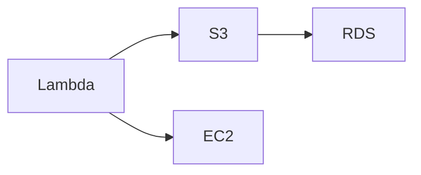

# AWS Icons for Mermaid

Complete AWS icon pack for use with Mermaid.js architecture diagrams. Contains **855 AWS icons** including services, resources, and categories from AWS Architecture Icons.

## Quick Start

> **Migrating from Iconify's `logos` pack?** See the [Migration Guide](MIGRATION_GUIDE.md) for step-by-step instructions and icon name mappings.

### Load Icons in Mermaid

```javascript
import mermaid from 'mermaid';

mermaid.registerIconPacks([
  {
    name: 'aws',
    loader: () =>
      fetch('https://raw.githubusercontent.com/harmalh/aws-mermaid-icons/main/iconify-json/aws-icons.json')
        .then((res) => res.json()),
  },
]);

mermaid.initialize({ startOnLoad: true });
```

### Use in Diagrams



**With AWS Icons** (architecture-beta syntax):
```text
architecture-beta
  group aws-services(aws:aws)[AWS Services] {
    service lambda(aws:aws-lambda)[Lambda]
    service s3(aws:amazon-simple-storage-service)[S3]
    service ec2(aws:aws-ec2)[EC2]
    service rds(aws:amazon-rds)[RDS]
  }
```

> **Note**: The `architecture-beta` diagram type requires Mermaid v11+ and may not render in GitHub's markdown preview. Use the HTML examples below for full functionality.

## Icon Naming

Icons use the format `(aws:icon-name)` in Mermaid diagrams. The naming conventions are:

- **AWS Services**: `(aws:aws-{service-name})` (e.g., `(aws:aws-lambda)`, `(aws:aws-glue)`)
- **Amazon Services**: `(aws:amazon-{service-name})` (e.g., `(aws:amazon-rds)`, `(aws:amazon-s3)`)
- **Resource Icons**: `(aws:{resource-name})` (e.g., `(aws:amazon-eventbridge-topic)`)

**Note**: In architecture diagrams, icons are specified in parentheses: `service name(aws:icon-name)[Label]`

## Contents

- **855 icons** including:
  - **~300-400 AWS service icons** (Arch_*)
  - **~200-300 resource icons** (Res_*) - e.g., S3 buckets, EventBridge topics
  - **~50-100 category/group icons** - Architecture categories and groups
- **Iconify JSON format** - Compatible with Mermaid and Iconify
- **SVG sources** - Original SVG files included
- **All AWS services** - Including ones already in Iconify

## Files

- `iconify-json/aws-icons.json` - Complete icon pack in Iconify format
- `svg/` - Source SVG files (for reference/editing)

## Building

To rebuild the icon pack from source:

```bash
npm run custom:build
```

This will:
1. Scan all SVG files in `Icons/` folder
2. **Strip background rectangles** - Removes full-coverage rectangles that cause black block rendering
3. **Remove empty background groups** - Cleans up groups that only contained backgrounds
4. Convert SVG paths to Iconify format with `currentColor` fills/strokes
5. Generate `iconify-json/aws-icons.json`
6. Copy SVG sources to `svg/`

### Background Removal

The build process automatically removes background rectangles from AWS Architecture Icons. These backgrounds cause icons to render as solid black blocks in Mermaid because they use `currentColor` which defaults to dark text color.

**What gets removed:**
- Full-coverage rectangles (matching viewBox dimensions)
- Rectangles with background-related IDs (`bg`, `background`, `rectangle`)
- Empty background groups

**Result:** Icons now have transparent backgrounds like the `logos` pack, allowing them to render properly in Mermaid diagrams.

### Customizing Icon Colors

Icons use `currentColor` for fills/strokes, which means they inherit the text color from Mermaid's theme. To customize colors:

**Option 1: Mermaid Theme Variables**
```javascript
mermaid.initialize({
    theme: 'default',
    themeVariables: {
        primaryTextColor: '#ff9900', // AWS orange
        primaryColor: '#ff9900',
    }
});
```

**Option 2: CSS Override**
```css
.mermaid .nodeIcon path {
    fill: #ff9900 !important; /* AWS orange */
}
```

**Option 3: Per-Icon Styling**
```css
.mermaid .nodeIcon[data-icon-name*="sagemaker"] path {
    fill: #8C4FFF !important; /* SageMaker purple */
}
```

## Usage Examples

### HTML Example

```html
<!DOCTYPE html>
<html>
<head>
  <script type="module">
    import mermaid from 'https://cdn.jsdelivr.net/npm/mermaid@11/dist/mermaid.esm.min.mjs';
    
    mermaid.registerIconPacks([
      {
        name: 'aws',
        loader: () =>
          fetch('https://raw.githubusercontent.com/harmalh/aws-mermaid-icons/main/iconify-json/aws-icons.json')
            .then((res) => res.json()),
      },
    ]);
    
    mermaid.initialize({ startOnLoad: true });
  </script>
</head>
<body>
  <div class="mermaid">
    architecture-beta
      service lambda(aws:aws-lambda)[Lambda]
      service s3(aws:amazon-simple-storage-service)[S3]
  </div>
</body>
</html>
```

### React Example

```jsx
import { useEffect } from 'react';
import mermaid from 'mermaid';

function MermaidDiagram() {
  useEffect(() => {
    mermaid.registerIconPacks([
      {
        name: 'aws',
        loader: () =>
          fetch('https://raw.githubusercontent.com/harmalh/aws-mermaid-icons/main/iconify-json/aws-icons.json')
            .then((res) => res.json()),
      },
    ]);
    
    mermaid.initialize({ startOnLoad: true });
    mermaid.contentLoaded();
  }, []);

  return <div className="mermaid">{diagramCode}</div>;
}
```

## Icon List

The pack includes icons for:

- **Compute**: EC2, Lambda, ECS, EKS, Fargate, App Runner, etc.
- **Storage**: S3, EBS, EFS, FSx, Glacier, etc.
- **Database**: RDS, DynamoDB, DocumentDB, Neptune, etc.
- **Networking**: VPC, CloudFront, Route 53, API Gateway, etc.
- **Security**: IAM, KMS, Secrets Manager, Shield, WAF, etc.
- **Analytics**: Athena, Redshift, EMR, Kinesis, QuickSight, etc.
- **AI/ML**: SageMaker, Bedrock, Rekognition, Comprehend, etc.
- **And 800+ more services and resources**

## Source

Icons are sourced from [AWS Architecture Icons](https://aws.amazon.com/architecture/icons/) and provided under the AWS Customer Agreement.

## License

This icon pack is provided under the same license as AWS Architecture Icons (AWS Customer Agreement). See AWS Architecture Icons terms for usage guidelines.

## Contributing

To add or update icons:

1. Add SVG files to `Icons/` folder
2. Run `npm run custom:build`
3. Commit changes
4. Submit pull request

## GitHub Repository Setup

This pack is designed to be hosted on GitHub for easy CDN access:

1. Create a new repository: `aws-mermaid-icons`
2. Copy `custom-pack/` contents to repository root
3. Update README with your GitHub username
4. Use raw GitHub URLs for loading icons

## Migration Guide

If you're currently using Iconify's `logos` pack for AWS icons, see the [Migration Guide](MIGRATION_GUIDE.md) for:
- Step-by-step migration instructions
- Complete icon name mapping table
- Code examples showing before/after
- Troubleshooting common issues

## Troubleshooting

### Icons Render as Black Blocks

**Problem:** Icons appear as solid black rectangles instead of showing the icon shape.

**Solution:** This was caused by background rectangles in the original AWS icons. The build process now automatically removes these backgrounds. If you're using an older version of the pack:

1. Rebuild the pack: `npm run custom:build`
2. Ensure you're using the latest `aws-icons.json` from the repository
3. Clear your browser cache and reload

### Icons Show Question Mark

**Problem:** Icons display as a blue square with a question mark.

**Causes:**
- Icon name doesn't exist in the pack
- Icon pack not registered before diagram rendering
- Network error loading the pack from GitHub

**Solutions:**
1. Check icon name exists: Search `iconify-json/aws-icons.json` for the icon name
2. Register pack before rendering: Ensure `mermaid.registerIconPacks()` is called before `mermaid.initialize()`
3. Check network: Verify GitHub raw URL is accessible

### Icons Are Too Dark/Light

**Problem:** Icons are hard to see due to color contrast.

**Solution:** Customize icon colors using theme variables or CSS (see "Customizing Icon Colors" section above).

## Support

For issues or questions:
- Open an issue on GitHub
- Check [Mermaid documentation](https://mermaid.js.org/config/icons.html)
- Review [Iconify format documentation](https://iconify.design/docs/)
- See [Migration Guide](MIGRATION_GUIDE.md) for help migrating from `logos` pack
