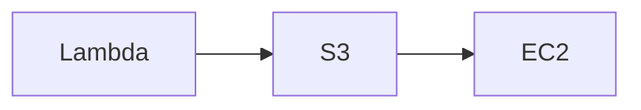

# Usage Guide - AWS Icons for Mermaid

## Quick Start

### 1. Load Icons in Your Application

```javascript
import mermaid from 'mermaid';

mermaid.registerIconPacks([
  {
    name: 'aws',
    loader: () =>
      fetch('https://raw.githubusercontent.com/harmalh/aws-mermaid-icons/main/iconify-json/aws-icons.json')
        .then((res) => res.json()),
  },
]);

mermaid.initialize({ startOnLoad: true });
```

### 2. Use in Mermaid Diagrams

**Simple Example** (GitHub-compatible):


**With AWS Icons** (architecture-beta - requires Mermaid v11+):
```text
architecture-beta
  service lambda icon:aws:aws-lambda
  service s3 icon:aws:aws-s3
  service ec2 icon:aws:aws-ec2
```

> **Note**: GitHub's markdown preview doesn't support `architecture-beta` diagrams. Use the HTML examples below for full icon support.

## Icon Naming

All icons use the prefix `aws:` followed by the icon name.

### Naming Patterns

- **AWS Services**: `aws:aws-{service}` (e.g., `aws:aws-lambda`, `aws:aws-s3`)
- **Amazon Services**: `aws:amazon-{service}` (e.g., `aws:amazon-rds`, `aws:amazon-ec2`)
- **Resources**: `aws:{resource-name}` (e.g., `aws:amazon-eventbridge-topic`)

### Finding Icon Names

Icon names are derived from the original AWS Architecture Icon filenames:
- `Arch_AWS-Lambda_48.svg` → `aws:aws-lambda`
- `Arch_Amazon-RDS_48.svg` → `aws:amazon-rds`
- `Res_Amazon-EventBridge_Topic_48.svg` → `aws:amazon-eventbridge-topic`

## Complete Examples

### HTML Example

```html
<!DOCTYPE html>
<html>
<head>
  <script type="module">
    import mermaid from 'https://cdn.jsdelivr.net/npm/mermaid@11/dist/mermaid.esm.min.mjs';
    
    mermaid.registerIconPacks([
      {
        name: 'aws',
        loader: () =>
          fetch('https://raw.githubusercontent.com/harmalh/aws-mermaid-icons/main/iconify-json/aws-icons.json')
            .then((res) => res.json()),
      },
    ]);
    
    mermaid.initialize({ startOnLoad: true });
  </script>
</head>
<body>
  <div class="mermaid">
    architecture-beta
      service lambda icon:aws:aws-lambda
      service s3 icon:aws:aws-s3
  </div>
</body>
</html>
```

### React Example

```jsx
import { useEffect } from 'react';
import mermaid from 'mermaid';

function AWSArchitectureDiagram() {
  useEffect(() => {
    // Register AWS icons
    mermaid.registerIconPacks([
      {
        name: 'aws',
        loader: () =>
          fetch('https://raw.githubusercontent.com/harmalh/aws-mermaid-icons/main/iconify-json/aws-icons.json')
            .then((res) => res.json()),
      },
    ]);
    
    mermaid.initialize({ startOnLoad: true });
    mermaid.contentLoaded();
  }, []);

  const diagram = `
    architecture-beta
      group compute "Compute" {
        service lambda icon:aws:aws-lambda
        service ec2 icon:aws:aws-ec2
      }
      group storage "Storage" {
        service s3 icon:aws:aws-s3
        service rds icon:aws:amazon-rds
      }
  `;

  return <div className="mermaid">{diagram}</div>;
}
```

### Vue Example

```vue
<template>
  <div class="mermaid">{{ diagram }}</div>
</template>

<script setup>
import { onMounted } from 'vue';
import mermaid from 'mermaid';

const diagram = `
  architecture-beta
    service lambda icon:aws:aws-lambda
    service s3 icon:aws:aws-s3
`;

onMounted(() => {
  mermaid.registerIconPacks([
    {
      name: 'aws',
      loader: () =>
        fetch('https://raw.githubusercontent.com/harmalh/aws-mermaid-icons/main/iconify-json/aws-icons.json')
          .then((res) => res.json()),
    },
  ]);
  
  mermaid.initialize({ startOnLoad: true });
  mermaid.contentLoaded();
});
</script>
```

## Available Icons

This pack includes **855 AWS icons** (services, resources, and categories) covering:

- **Compute**: EC2, Lambda, ECS, EKS, Fargate, App Runner, Batch, etc.
- **Storage**: S3, EBS, EFS, FSx, Glacier, Storage Gateway, etc.
- **Database**: RDS, DynamoDB, DocumentDB, Neptune, ElastiCache, etc.
- **Networking**: VPC, CloudFront, Route 53, API Gateway, Direct Connect, etc.
- **Security**: IAM, KMS, Secrets Manager, Shield, WAF, GuardDuty, etc.
- **Analytics**: Athena, Redshift, EMR, Kinesis, QuickSight, Glue, etc.
- **AI/ML**: SageMaker, Bedrock, Rekognition, Comprehend, Textract, etc.
- **Management**: CloudWatch, CloudTrail, Systems Manager, Config, etc.
- **And 800+ more services and resources**

## Troubleshooting

### Icons Not Loading

1. **Check URL**: Ensure the GitHub raw URL is correct
2. **Check CORS**: GitHub raw URLs support CORS by default
3. **Check Console**: Look for fetch errors in browser console
4. **Verify Format**: Ensure `aws-icons.json` is valid JSON

### Icons Not Showing

1. **Check Icon Name**: Icon names are case-sensitive (e.g., `aws:aws-lambda`)
2. **Check Prefix**: Must use `aws:` prefix (not `logos:`)
3. **Verify Registration**: Ensure `registerIconPacks` was called before rendering

### Common Issues

- **Wrong prefix**: Use `aws:` not `logos:`
- **Case sensitivity**: Icon names are lowercase with hyphens
- **Timing**: Register icons before initializing Mermaid

## Updating Icons

To update the icon pack:

1. Add/modify SVG files in source `Icons/` folder
2. Run `npm run custom:build` in the main project
3. Copy updated `aws-icons.json` to this repository
4. Commit and push changes

## Support

For issues or questions:
- Open an issue on GitHub
- Check [Mermaid documentation](https://mermaid.js.org/config/icons.html)
- Review icon names in `iconify-json/aws-icons.json`
